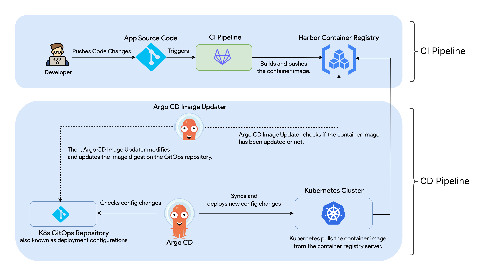

# GitOps CI/CD in Kubernetes Handbook
[https://thezawzaw.github.io/gitops-k8s-handbook](https://thezawzaw.github.io/gitops-k8s-handbook)

A comprehensive and hands-on practical guide to building a fully automated CI/CD pipeline using GitLab CI, GitOps Argo CD, and Argo CD image updater on the Kubernetes platform.

## Table of Contents

What you'll learn in this guide:

- **[Step 1] Containerizing an application**  
  _In this section, you'll learn how to write a [Dockerfile](https://docs.docker.com/reference/dockerfile/) to containerize a sample Python application._

- **[Step 2] Building GitLab CI Pipeline**  
  _In this section, you'll learn how to configure a [GitLab CI](https://docs.gitlab.com/ci/) pipeline to build and push Docker container images using Buildah._

- **[Step 3] Creating a Kubernetes Cluster**  
  _In this you'll learn how to set up a Kubernetes Cluster with [K3s, Lightweight Kubernetes](https://k3s.io/)._
 
- **[Step 4] Writing a Kubernetes Helm Chart from Scratch**  
  _In this section, you'll learn how to write a [Helm Chart](https://helm.sh/) to deploy the Podinfo Python sample application on Kubernetes._

- **[Step 5] Configuring GitOps Argo CD on Kubernetes**  
  _In this section, you'll learn how to set up and configure [Argo CD](https://argo-cd.readthedocs.io/en/stable/) as GitOps CD to deploy applications automatically on Kubernetes._

- **[Setup 6] Configuring Argo CD Image Updater**  
  _In this section, you'll learn how to set up and configure [Argo CD Image Updater](https://argocd-image-updater.readthedocs.io/en/stable/) to automate updating the Docker container images automatically on Kubernetes._

The GitOps CI/CD in Kubernetes handbook is available here: [https://thezawzaw.github.io/gitops-k8s-handbook](https://thezawzaw.github.io/gitops-k8s-handbook)

