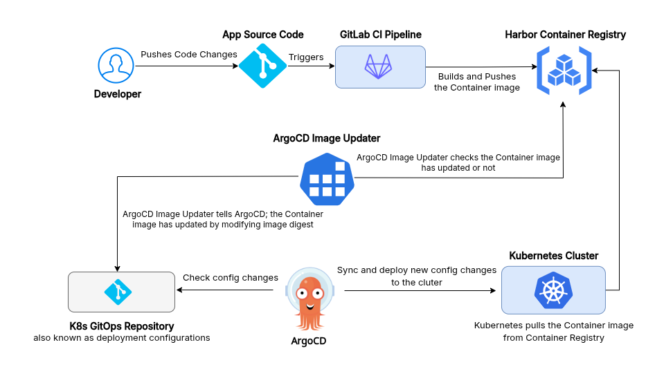

# GitOps in Kubernetes Guide
## Hands-on Practical Guide to Automated Deployments with GitLab CI and Argo CD on Kubernetes



## Introduction

This hands-on practical guide is to demostrate GitOps in Kubernetes with GitLab CI and ArgoCD using simple Python Flask web application. It focuses on how to Containerize application, Continuous integration, Continuous delivery and automated application deployment on Kubernetes.

## Objectives
You'll learn the following topics from this hands-on practical guide:

 - Write Dockerfile] to containerize Python Flask application.
 - Configure GitLab CI pipeline to build and push Docker container images using Buildah.
 - Setup a Kubernetes Cluster with K3s, Lightweight Kubernetes.
 - Write Helm Chart to deploy the podinfo application on Kubernetes.
 - Setup Argo CD to deploy applications automatically on Kubernetes.
 - Configure Argo CD Image Updater to automate updating and pulling the container images automatically.

This GitOps hands-on practical guide is based on [GitOps in Kubernetes GitLab CI and ArgoCD](https://levelup.gitconnected.com/gitops-in-kubernetes-with-gitlab-ci-and-argocd-9e20b5d3b55b) article by Poom Wettayakorn. But, we will discuss more details and focused on beginner friently guide.

## Containerize application
Firstly, we will use forked `pod-info` Python Flask application to demonstrate GitOps. We need to write Dockerfile to containerize application.

Git clone `pod-info` repository:
```
git clone git@gitlab.com:zawzaw.me/podinfo-sample-app.git
```

Dockerfile is very simple. Install required Python packages with pip and serve Python Flask application with `gunicorn` server.
```
FROM docker-repo.frontiir.net/sa-dev/python:3.6-slim

ENV FLASK_APP run.py
ENV APP_WORKDIR=/usr/src/app
ENV APP_USER=frontiir
ENV APP_PORT=5005

RUN python -m pip install --upgrade pip

RUN useradd --create-home ${APP_USER}

WORKDIR ${APP_WORKDIR}

COPY . .

RUN chown ${APP_USER}:${APP_USER} -R ${APP_WORKDIR}

RUN pip install -r requirements.txt

USER ${APP_USER}

EXPOSE ${APP_PORT}

ENTRYPOINT ["gunicorn", "--config", "gunicorn-cfg.py", "run:app"]
```

Build pod-info Docker image locally:
```
docker build -t pod-info .
```

Run pod-info locally with docker run:
```
docker run -p 5005:5005 -it --rm pod-info:latest
```

Test pod-info application locally:
 - http://0.0.0.0:5005


## Configure GitLab CI Pipeline to Build and Push Docker images

We use Buildah to build and push Docker container images automatically to Harbor Docker registry. Firsty, we need to add two CI variables `REGISTRY_HOST` `DOCKER_CFG` in pod-info Project Settings >> CI/CD >> Variables.

 - REGISTRY_HOST: `harbor-dev-repo.ops.io`
 - DOCKER_CFG: `{"auths": {"harbor-dev-repo.ops.io": {"auth": "YWRtaW46SGFyYm9yMTIzNDU="}}}`

I've already written `.gitlab-ci.yml` GitLab CI configuration on pod-info repository. But, you can write own `.gitlab-ci.yml` configuration under `pod-info` project root directory like this:

GitLab CI Configuration [https://gitlab.com/zawzaw.me/podinfo-sample-app/-/blob/main/.gitlab-ci.yml](https://gitlab.com/zawzaw.me/podinfo-sample-app/-/blob/main/.gitlab-ci.yml)

```yaml
#
# GitLab CI Configuration
#

#
# Define the CI stages here.
#
stages:
  - build

#
# Define the reusable templates here
# to build and push the Docker container images to the Container Registry server.
#
.template_build: &template_build
  stage: build
  image: quay.io/buildah/stable
  variables:
    STORAGE_DRIVER: vfs
    BUILDAH_FORMAT: docker
    TARGET_IMAGE_NAME: ""
    TARGET_IMAGE_TAG: ""
  script:
    - echo ${DOCKER_CFG} > /home/build/config.json
    - export REGISTRY_AUTH_FILE=/home/build/config.json
    - export IMAGE_REPO="${REGISTRY_HOST}/library/${TARGET_IMAGE_NAME}"
    - echo "Building Docker container image [ $IMAGE_REPO:$TARGET_IMAGE_TAG ]..."
    - >-
      buildah build
      --file ${CI_PROJECT_DIR}/Dockerfile
      --layers
      --cache-to ${IMAGE_REPO}/cache
      --cache-from ${IMAGE_REPO}/cache
      --tls-verify=false
      --tag ${IMAGE_REPO}:${TARGET_IMAGE_TAG} .
    - buildah push --tls-verify=false ${IMAGE_REPO}:${TARGET_IMAGE_TAG}

#
# GitLab CI Job: build-image-main
# to build the Docker container image with latest image tag name in only 'main' branch.
#
build-image-main:
  <<: *template_build
  variables:
    TARGET_IMAGE_NAME: "${CI_PROJECT_NAME}"
    TARGET_IMAGE_TAG: "latest"
  only:
    refs:
      - main

#
# GitLab CI Job: build-image-dev
# to build the Docker container image with the Git branch name as image tag name in only 'develop' branch.
#
build-image-dev:
  <<: *template_build
  variables:
    TARGET_IMAGE_NAME: "${CI_PROJECT_NAME}"
    TARGET_IMAGE_TAG: "${CI_COMMIT_REF_SLUG}"
  only:
    refs:
      - develop
```

Basically,
kaniko builds Docker container image with Dockerfile and pushes the target container image to internal Harbor container registry server when you push changes to pod-info repository's master branch.

