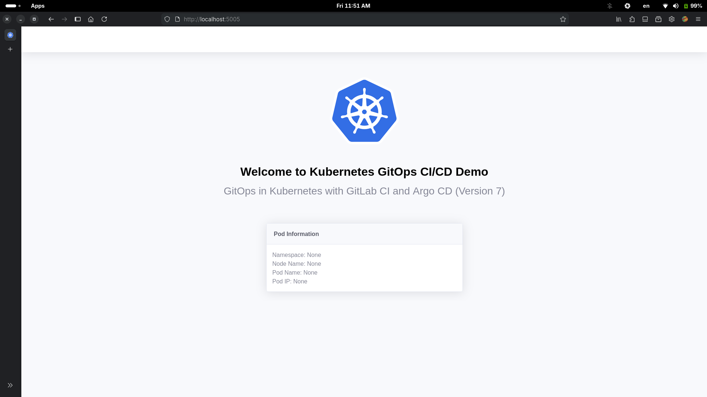

# GitOps CI/CD in Kubernetes

## A Hands-on Practical Guide to Building a Fully Automated CI/CD Pipeline Using GitLab CI and GitOps Argo CD on Kubernetes


## Introduction

This hands-on practical guide is to demonstrate GitOps CI/CD automation in Kubernetes with GitLab CI and Argo CD using the [podinfo-sample](https://gitlab.com/thezawzaw/podinfo-sample) Python application. It mainly focuses on how to containerize an application, configure Continuous Integration (CI), Continuous Deployment (CD) and fully automated application deployment on Kubernetes.

## Summary: Objectives

What you'll learn in this hands-on practical guide:

- Write a [Dockerfile](https://docs.docker.com/reference/dockerfile/) to containerize a sample Python application.
- Configure the [GitLab CI](https://docs.gitlab.com/ci/) pipeline to build and push Docker container images using Buildah.
- Setup a Kubernetes Cluster with [K3s, Lightweight Kubernetes](https://k3s.io/).
- Write a [Helm Chart](https://helm.sh/) to deploy the podinfo-sample Python application on Kubernetes.
- Configure [Argo CD](https://argo-cd.readthedocs.io/en/stable/) as GitOps CD to deploy applications automatically on Kubernetes.
- Configure [Argo CD Image Updater](https://argocd-image-updater.readthedocs.io/en/stable/) to automate updating and pulling the Docker container images automatically.

This GitOps hands-on practical guide is based on the [GitOps in Kubernetes with GitLab CI and ArgoCD](https://levelup.gitconnected.com/gitops-in-kubernetes-with-gitlab-ci-and-argocd-9e20b5d3b55b) article by Poom Wettayakorn. But, I will share more details and focus on a beginner-friently guide.

## [1] Containerizing an application

> [!NOTE]
> 
> **Before You Begin**
>
> Make sure you are familiar with Docker before you begin.
>
> - Install Docker: https://www.docker.com/get-started
> - Dockerfile Reference: https://docs.docker.com/reference/dockerfile
>
> If you are not familiar with Docker, please learn it first with the following _Docker for Beginners_ tutorial.
>
> Docker for Beginners: https://docker-curriculum.com/

In this guide, I will use the [podinfo-sample](https://gitlab.com/thezawzaw/podinfo-sample) Python application to demonstrate GitOps in Kubernetes. Firstly, you will need to write Dockerfile to containerize this Python application.

Git Repository: [https://gitlab.com/thezawzaw/podinfo-sample](https://gitlab.com/thezawzaw/podinfo-sample)

Fork this Git repository under your namespace and clone with the Git command-line tool.

```sh
$ git clone git@gitlab.com:<your-username>/podinfo-sample.git
```

For example, replace `gitops-example` with your username.

```sh
$ git clone git@gitlab.com:gitops-example/podinfo-sample.git
```

### Writing a Dockerfile

In the [podinfo-sample](https://gitlab.com/thezawzaw/podinfo-sample) Git repository, I've already written a Dockerfile to containerize the app.

```Dockerfile
#
# Stage (1): Builder Stage
#
# Install the app source code and required Python packages.
#
FROM python:3.12-alpine AS builder

ENV APP_WORKDIR=/app
ENV PATH="${APP_WORKDIR}/venv/bin:$PATH"

WORKDIR ${APP_WORKDIR}

COPY . .

RUN apk add --no-cache \
    gcc musl-dev && \
    python -m venv venv && \
    pip install --upgrade pip && \
    pip install -r requirements.txt

#
# Stage (2): Runtime Stage
#
# The final runtime environment for serving the Podinfo sample application.
#
FROM python:3.12-alpine AS runtime

ENV FLASK_APP=run.py
ENV APP_WORKDIR=/app
ENV APP_USER=zawzaw
ENV APP_GROUP=zawzaw
ENV APP_PORT=5005
ENV PATH="${APP_WORKDIR}/venv/bin:$PATH"

RUN adduser -D ${APP_USER}

WORKDIR ${APP_WORKDIR}

RUN pip uninstall pip -y
COPY --from=builder --chown=${APP_USER}:${APP_GROUP} ${APP_WORKDIR} ${APP_WORKDIR}

USER ${APP_USER}

EXPOSE ${APP_PORT}

ENTRYPOINT ["gunicorn", "--config", "gunicorn-cfg.py", "run:app"]
```

**_Explanation:_**

In the Stage (1) — Builder Stage:

- Create an application workdir.
- Add the application source code, create the Python virtual environment (venv) and install required packages with pip.

In the Stage (2) — Runtime Stage:

- Copy the created Python venv from the builder stage.
- Then, create and switch to a normal user and serve the Podinfo Python application with the Gunicorn server.

### Building and Testing the Container Image Locally

To build the Docker image locally, run the following `docker build` command:

```
$ cd podinfo-sample
$ docker build -t podinfo-sample:local .
```

To run and test the Podinfo application locally with `docker run`:

```
$ docker run -p 5005:5005 -it --rm --name podinfo podinfo-sample:local
```

To test the Podinfo application locally, open the following localhost address in the web browser:

URL: [http://localhost:5005](http://localhost:5005)



---

## [2] Building GitLab CI Pipeline

> [!NOTE]
> 
> **Before You Begin**
> 
> Make sure you've learned the basics of GitLab CI and YAML syntax. Please, start with the following tutorials.
> 
>  - Get started with GitLab CI: https://docs.gitlab.com/ci/
>  - CI/CD YAML Syntax Reference: https://docs.gitlab.com/ci/yaml/

In this section, I will use Buildah to build and push Docker container images automatically to the Harbor Docker registry.

[Buildah](https://github.com/containers/buildah) is a tool that facilitates building [Open Container Initiative (OCI)](https://www.opencontainers.org/) Container images. Buildah is designed to run in **Userspace**, also known as **Rootless mode** and does not require a root-privileged daemon like traditional Docker daemon. This is one of its primary advantages, especially in secured and automated CI/CD environments. Please, see the following GitHub wiki page.

**Building Container Images with Buildah in GitLab CI:** https://github.com/thezawzaw/platform-wiki/wiki/Building-Container-Images-with-Buildah-in-GitLab-CI

### GitLab CI Configuration

Firsty, you need to fork the Podinfo sample application repository that I've mentioned previously. (If you are already forked, you don't need to fork again.)

Podinfo Sample Git Repository: https://gitlab.com/thezawzaw/podinfo-sample

Then, you need to add two GitLab CI variables `REGISTRY_HOST` `DOCKER_CFG` on the Podinfo repository:

Go to your Podinfo Git repository >> <kbd>Project Settings</kbd> >> <kbd>CI/CD</kbd> >> <kbd>Variables</kbd>, and add the following key/value GitLab CI variables.

> [!NOTE]
> Replace with your container registry credentials.
>
> - Key: `REGISTRY_HOST`, Value: `<your-registry-host>`
> - Key: `DOCKER_CFG`, Value: `<your-registry-auth-creds>`

For example,
- REGISTRY_HOST: `harbor-dev-repo.ops.io`
- DOCKER_CFG: `{"auths": {"harbor-dev-repo.ops.io": {"auth": "YWRtaW46SGFyYm9yMTIzNDU="}}}`

I've already created `.gitlab-ci.yml` GitLab CI configuration on the Podinfo Git repository. But, you can write your own `.gitlab-ci.yml` configuration under your Podinfo sample project's root directory.

GitLab CI Configuration [https://gitlab.com/thezawzaw/podinfo-sample/-/blob/main/.gitlab-ci.yml](https://gitlab.com/thezawzaw/podinfo-sample/-/blob/main/.gitlab-ci.yml)

```yaml
#
# GitLab CI Configuration
#

#
# Define the CI stages here.
#
stages:
  - build
  - scan

# Define global variables here.
variables:
  IMAGE_REPO: "${REGISTRY_HOST}/library/${CI_PROJECT_NAME}"

###################################################################################
#                                                                                 #
# GitLab CI Templates                                                             #
#                                                                                 #
###################################################################################

# Template ---> template_build
# to build and push the Docker container images to the Container Registry server.
.template_build: &template_build
  stage: build
  image: quay.io/buildah/stable
  variables:
    BUILDAH_FORMAT: docker
    TARGET_IMAGE_TAG: ""
  script:
    - echo ${DOCKER_CFG} > /home/build/config.json
    - export REGISTRY_AUTH_FILE=/home/build/config.json
    - echo "Building Docker container image [ $IMAGE_REPO:$TARGET_IMAGE_TAG ]..."
    - >-
      buildah build
      --file ${CI_PROJECT_DIR}/Dockerfile
      --layers
      --cache-to ${IMAGE_REPO}/cache
      --cache-from ${IMAGE_REPO}/cache
      --tls-verify=false
      --tag ${IMAGE_REPO}:${TARGET_IMAGE_TAG} .
    - buildah push --tls-verify=false ${IMAGE_REPO}:${TARGET_IMAGE_TAG}
    - buildah rmi -f ${IMAGE_REPO}:${TARGET_IMAGE_TAG}

# Template ---> template_trivy_scan
# to scan and find vulnerabilities of the Docker container images.
.template_trivy_scan: &template_trivy_scan
  stage: scan
  image:
    name: docker.io/aquasec/trivy:0.67.2
    entrypoint: [""]
  variables:
    TRIVY_SEVERITY: "HIGH,CRITICAL"
    TRIVY_EXIT_CODE: "1"
    TARGET_IMAGE_TAG: ""
  script:
    - echo "Scanning Docker container image [ $IMAGE_REPO:$TARGET_IMAGE_TAG ]..."
    - >-
      trivy --cache-dir "${CI_PROJECT_DIR}/trivy/"
      image
      --image-src remote
      --insecure ${IMAGE_REPO}:${TARGET_IMAGE_TAG}
  cache:
    key: trivy-cache
    paths:
      - "${CI_PROJECT_DIR}/trivy/"
  when: manual


##########################################################################################
#                                                                                        #
# GitLab CI Jobs                                                                         #
#                                                                                        #
##########################################################################################

#
# Build CI Job ---> build-image-dev
# to build the Docker container image with the Git branch name as image tag name when you push changes into the 'develop' branch.
#
build-image-dev:
  <<: *template_build
  variables:
    TARGET_IMAGE_TAG: "${CI_COMMIT_REF_SLUG}"
  rules:
    - if: '$CI_COMMIT_BRANCH == "develop"'

#
# Build CI Job ---> build-image-main
# to build the Docker container image with latest image tag name when you push changes into the 'main' branch.
#
build-image-main:
  <<: *template_build
  variables:
    TARGET_IMAGE_TAG: "latest"
  rules:
    - if: '$CI_COMMIT_BRANCH == "main"'

#
# Build CI Job ---> build-image-tag
# to build the Docker container image with the Git tag name as image tag when you create a Git tag.
#
build-image-tag:
  <<: *template_build
  variables:
    TARGET_IMAGE_TAG: "${CI_COMMIT_TAG}"
  rules:
    - if: "$CI_COMMIT_TAG"

#
# Scan CI Job ---> trivy-scan-dev
# to scan and find vulnerabilities of the Docker container image when you push changes into the 'develop' branch.
#
trivy-scan-dev:
  <<: *template_trivy_scan
  variables:
    TARGET_IMAGE_TAG: "${CI_COMMIT_REF_SLUG}"
  rules:
    - if: '$CI_COMMIT_BRANCH == "develop"'

#
# Scan CI Job ---> trivy-scan-main
# to scan and find vulnerabilities of the Docker container image when push changes into the 'main' branch.
#
trivy-scan-main:
  <<: *template_trivy_scan
  variables:
    TARGET_IMAGE_TAG: "latest"
  rules:
    - if: '$CI_COMMIT_BRANCH == "main"'

#
# Scan CI Job ---> trivy-scan-tag
# to scan and find vulnerabilities of the Docker container image when you create a Git tag.
#
trivy-scan-tag:
  <<: *template_trivy_scan
  variables:
    TARGET_IMAGE_TAG: "${CI_COMMIT_TAG}"
  rules:
    - if: "$CI_COMMIT_TAG"
```

**_Explanation:_**

[Buildah](https://github.com/containers/buildah) builds the Docker container image of the Podinfo application with Dockerfile and pushes the target container image to internal Harbor container registry server when you push changes into the podinfo-sample Git repository.

